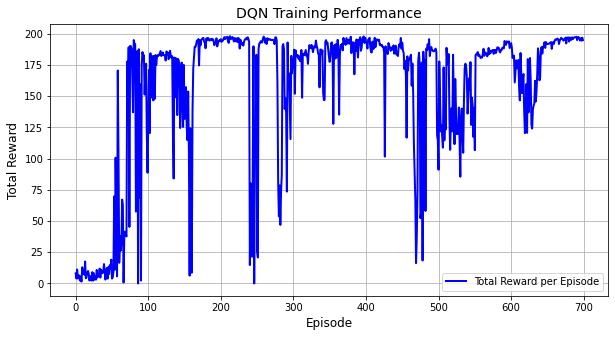
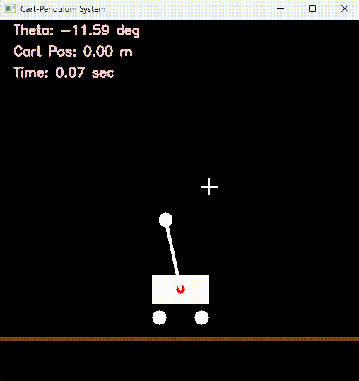
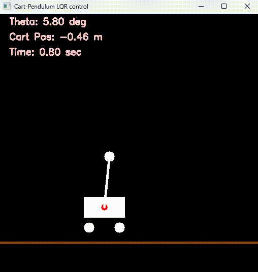

# Inverted pendulum on moving cart

## Introduction 

The Inverted Pendulum is a classic problem in dynamics and control systems, often used to demonstrate control theory concepts. The goal of this project is to balance an inverted pendulum on a moving cart using LQR control and compare it with Deep Reinforcement Learning. The simulation was made using python.

## Equations

By denoting $$\theta$$ as the angle between upright vertical direction and the pendulum, and $$x$$ as the horizontal coordinate, the equations governing the system are :

$$ (M + m)\ddot{x} + b_x\dot{x} - ml\ddot{\theta}\cos\theta + ml\dot{\theta}^2\sin\theta = F $$
$$l\ddot{\theta} + b_\theta\dot{\theta} - g\sin\theta = \ddot{x}\cos\theta $$

Which can be linearized as :

```math
\begin{bmatrix}\dot{x}\\\ddot{x}\\\dot{\theta}\\\ddot{\theta}\end{bmatrix} = \begin{bmatrix}0 & 1 & 0 & 0\\ 0 & -b_x & \frac{g*m}{M} & 0 \\ 0 & \frac{-b_x}{(M*l)} & \frac{(m+M)*g}{(M*l)} & \frac{-b_\theta*(m+M)*g}{(M*l)} \\ 0 & 0 & 0 & 1 \end{bmatrix} \begin{bmatrix}x\\\dot{x}\\\theta\\\dot{\theta}\end{bmatrix} + \begin{bmatrix}0\\\ \frac{1}{M}\\0\\\frac{1}{M*l}\end{bmatrix} u
```
Given :

$$g$$ gravity constant

$$M$$ mass of cart

$$m$$ mass of pendulum

$$l$$ length of pendulum

$$b_x$$ damping effect factor on the cart

$$b_\theta$$ damping effect factor on the pendulum


## Code

To run the LQR control script, use the following command : 

```
python lqr_control.py
```

To run the RL control script, use the following command : 

```
python rl_control.py
```

This script will load a model that has already been trained and simulate its actions. To run your own training with your own parameters, please modify the `train_dqn.py` script

The result of my own training for the DQN agent can be seen below :

<p align="center">
  
</p>

## Results

We expose here the results of the simulation, first with the uncontrolled system where the pendulum will simply fall, and then both control methods (LQR and RL) 

<p align="center">
  
</p>

<p align="center">
  
</p>


